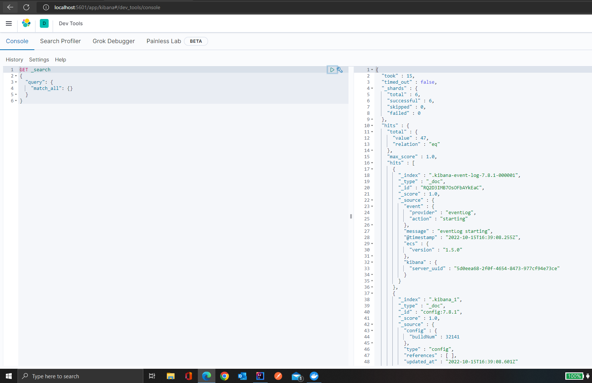

# kafka spark elasticsearch on Docker Kubernetes
## Airline tweets and cryptocurrency data

[](https://docs.cloud.coinbase.com/exchange/docs/websocket-overview)


### solution Contains following modules
- apache kafka zookeeper for pub/sub architechture
- apache spark for small processing
- elasticsearch for nosql DB and storage with own dockerfile
- kibana for visualization for real time cryptocurrency data
- docker for containing all the deployments 
- kubernetes for orchestration of kafka zookeeper services
- apache nifi for data ingestion


### process (airline tweets)

We have used US Airline tweets data as a source and data will be ingested using a python script , which will read the csv and create json encoded message to ingest to kafa topic 'airline-tweets' running on docker
```sh 
tweet-producer.py
```

Kafka consumer running in python wll read the data from topic 'airline-tweets' and process it in proper format
```
spark-consumer.py
```
Pytohn kafka consumer will connect to spark context running on docker to perform some manipulation on tweets and their raw text
Spark will get the word count fo every tweet and python will create a json request to ingest the entire data to elasticsearch running on docker

We have separate scripts for topic creation and topic deletion for zookeeper running on Docker
```
create-topic.py
```
```
a = AdminClient({'bootstrap.servers': 'localhost:19092'})
new_topics = [NewTopic(topic, num_partitions=1) for topic in ["airline-tweet-topic"]]
fs = a.create_topics(new_topics)

for topic, f in fs.items():
    try:
        f.result()  # The result itself is None
        print("Topic {} created".format(topic))
    except Exception as e:
        print("Failed to create topic {}: {}".format(topic, e))
```

### process (cryptocurrency data from COINBASE)
Python script crypto-producer.py will hit web socket api and fech the live stream data for Etherium currency current value and trading volume
```
crypt-producer.py
```
```
wss://ws-feed.exchange.coinbase.com
```
Header value required to be paased to the above socket address is as follow
```
def open_conn(ws):
    subscribe = {
        "type": "subscribe",
        "product_ids": ["ETH-EUR"],
        "channels": ["ticker"]
    }
    print('inside')
    try:
        ws.send(json.dumps(subscribe))
    except Exception as e:
        print(e)
    print('socket open')
```


Consumer file will read the message string decode it and make to suitable for ingestion and ingest into elasticsearch with different index
```
crypto-consumer.py
```


> The overriding design goal for Markdown's
> formatting syntax is to make it as readable


This text you see here is *actually- written in Markdown! To get a feel
for Markdown's syntax, type some text into the left window and
watch the results in the right.

## Docker

I have Created separete images for kafka/zookeeper apache and elasticsearch/kibana
I kept default configuation for elasticsearch docker and kibana docker ports 

every folder has its own docker compose file and command to up the container is 

``sh
docker-compose -f docker-compose.yml up -d
``

Inside elasticsearch-kibana directory we have Dockerfile which will download 
and configure
- ubuntu20
- java 8
- elasticsearch-8.0.0

and create own image. command to build own the image is
```shell
docker build -t=es-image .
```

> Note: `elasticsearch.username: "elastic"`
`elasticsearch.password: "elastic"` is separately configured from config file.
> 

We can verify all the above deployments from browser and docker desktop interface.

```sh
127.0.0.1:5601
```




## Kubernetes

### I tried to use kubernetes for orchestration of multiple container specially 
spark and kafka/zookeeper

- following are the configuration details for kafka/zookeeper on kubernetes
I used confulent original kafka and zookeeper image with kubernetes service deployment 
- brokers are listening on 9092 and 29092 port

### Broker deployment 
```yaml
kind: Deployment
apiVersion: apps/v1
metadata:
  name: kafka-deployment
  labels:
    app: kafka
spec:
  replicas: 1
  selector:
    matchLabels:
      app: kafka
  template:
    metadata:
      labels:
        app: kafka
    spec:
      containers:
        - name: broker
          image: confluentinc/cp-kafka:7.0.1
          ports:
            - containerPort: 9092
          env:
            - name: KAFKA_BROKER_ID
              value: "1"
            - name: KAFKA_ZOOKEEPER_CONNECT
              value: 'zookeeper-service:2181'
            - name: KAFKA_LISTENER_SECURITY_PROTOCOL_MAP
              value: PLAINTEXT:PLAINTEXT,PLAINTEXT_INTERNAL:PLAINTEXT
            - name: KAFKA_ADVERTISED_LISTENERS
              value: PLAINTEXT://:29092,PLAINTEXT_INTERNAL://kafka-service:9092
            - name: KAFKA_OFFSETS_TOPIC_REPLICATION_FACTOR
              value: "1"
            - name: KAFKA_TRANSACTION_STATE_LOG_MIN_ISR
              value: "1"
            - name: KAFKA_TRANSACTION_STATE_LOG_REPLICATION_FACTOR
              value: "1"
```

```yaml
apiVersion: v1
kind: Service
metadata:
  name: kafka-service
spec:
  selector:
    app: kafka
  ports:
    - protocol: TCP
      port: 9092
      targetPort: 9092
```
### zookeeper and service deployment

```yaml
apiVersion: apps/v1
kind: Deployment
metadata:
  name: zookeeper-deployment
  labels:
    app: zookeeper
spec:
  replicas: 1
  selector:
    matchLabels:
      app: zookeeper
  template:
    metadata:
      labels:
        app: zookeeper
    spec:
      containers:
        - name: zookeeper
          image: confluentinc/cp-zookeeper:7.0.1
          ports:
            - containerPort: 2181
          env:
            - name: ZOOKEEPER_CLIENT_PORT
              value: "2181"
            - name: ZOOKEEPER_TICK_TIME
              value: "2000"

---
apiVersion: v1
kind: Service
metadata:
  name: zookeeper-service
spec:
  selector:
    app: zookeeper
  ports:
    - protocol: TCP
      port: 2181
      targetPort: 2181
```


## Apache Nifi

- Apache nifi is installed using Docker image fetch from apache following is the conguration

```yaml
version: "3"
services:
    
    nifi_docker:
        image: apache/nifi:latest
        restart: always
        container_name: nifi_docker
        ports:
            - 8181:8181
        environment:
            - NIFI_WEB_HTTP_PORT=8181
            - NIFI_SENSITIVE_PROPS_KEY=abcdefghijkl
        volumes:
            - ./nifi/conf:/opt/nifi/nifi-current/conf
```

> Note:while installation found out that `NIFI_SENSITIVE_PROPS_KEY = abcdefghijkl` is mandatory and needs to be minimum 12 character 
>


## License

MIT

**Free Software, Hell Yeah!**

[//]: # (These are reference links used in the body of this note and get stripped out when the markdown processor does its job. There is no need to format nicely because it shouldn't be seen. Thanks SO - http://stackoverflow.com/questions/4823468/store-comments-in-markdown-syntax)

   [dill]: <https://github.com/joemccann/dillinger>
   [git-repo-url]: <https://github.com/joemccann/dillinger.git>
   [john gruber]: <http://daringfireball.net>
   [df1]: <http://daringfireball.net/projects/markdown/>
   [markdown-it]: <https://github.com/markdown-it/markdown-it>
   [Ace Editor]: <http://ace.ajax.org>
   [node.js]: <http://nodejs.org>
   [Twitter Bootstrap]: <http://twitter.github.com/bootstrap/>
   [jQuery]: <http://jquery.com>
   [@tjholowaychuk]: <http://twitter.com/tjholowaychuk>
   [express]: <http://expressjs.com>
   [AngularJS]: <http://angularjs.org>
   [Gulp]: <http://gulpjs.com>

   [PlDb]: <https://github.com/joemccann/dillinger/tree/master/plugins/dropbox/README.md>
   [PlGh]: <https://github.com/joemccann/dillinger/tree/master/plugins/github/README.md>
   [PlGd]: <https://github.com/joemccann/dillinger/tree/master/plugins/googledrive/README.md>
   [PlOd]: <https://github.com/joemccann/dillinger/tree/master/plugins/onedrive/README.md>
   [PlMe]: <https://github.com/joemccann/dillinger/tree/master/plugins/medium/README.md>
   [PlGa]: <https://github.com/RahulHP/dillinger/blob/master/plugins/googleanalytics/README.md>
